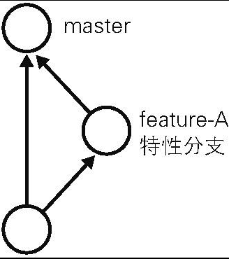

在进行多个并行作业时，我们会用到分支。在这类并行开发的过程中，往往同时存在多个最新代码状态。

master 分支是 Git 默认创建的分支，因此基本上所有开发都是以这个分支为中心进行的。

https://stackoverflow.com/questions/64249491/difference-between-main-branch-and-master-branch-in-github

GitHub 从 2020 年 10 月 1 日起默认创建 main 分支，不再是 master 分支。

## git branch

将分支名列表显示，同时可以确认当前所在分支。

分支左侧标有“*”（星号），表示这是我们当前所在的分支。

## git checkout -b

以当前的 master 分支为基础创建新的分支。

### 实例

1. 切换到 feature-A 分支并进行提交

```shell
git checkout -b feature-A
```

实际上，连续执行下面两条命令也能收到同样效果。

创建 feature-A 分支，并将当前分支切换为 feature-A 分支。

```shell
git branch feature-A
git checkout feature-A
```

feature-A 分支左侧标有“*”，表示当前分支为 feature-A。在这个状态下像正常开发那样修改代码、执行 git add 命令并进行提交的话，代码就会提交至 feature-A 分支。像这样不断对一个分支（例如 feature-A）进行提交的操作，我们称为“培育分支”。

2. 切换到 master 分支

```shell
git checkout master
```

feature-A 分支的更改不会影响到 master 分支，这正是在开发中创建分支的优点。只要创建多个分支，就可以在不互相影响的情况下同时进行多个功能的开发。

3. 切换回上一个分支

```shell
git checkout -
```

像上面这样用“-”（连字符）代替分支名，就可以切换至上一个分支。当然，将“-”替换成 feature-A 同样可以切换到 feature-A 分支。

## 特性分支

Git 与 Subversion（SVN）等集中型版本管理系统不同，创建分支时不需要连接中央仓库，所以能够相对轻松地创建分支。因此，当今大部分工作流程中都用到了特性（Topic）分支。

特性分支顾名思义，是集中实现单一特性（主题），除此之外不进行任何作业的分支。在日常开发中，往往会创建数个特性分支，同时在此之外再保留一个随时可以发布软件的稳定分支。稳定分支的角色通常由 master 分支担当（图 4.3）。



之前我们创建了 feature-A 分支，这一分支主要实现 feature-A，除 feature-A 的实现之外不进行任何作业。即便在开发过程中发现了 BUG，也需要再创建新的分支，在新分支中进行修正。

基于特定主题的作业在特性分支中进行，主题完成后再与 master 分支合并。只要保持这样一个开发流程，就能保证 master 分支可以随时供人查看。这样一来，其他开发者也可以放心大胆地从 master 分支创建新的特性分支。

## 主干分支

主干分支是刚才我们讲解的特性分支的原点，同时也是合并的终点。通常人们会用 master 分支作为主干分支。主干分支中并没有开发到一半的代码，可以随时供他人查看。

有时我们需要让这个主干分支总是配置在正式环境中，有时又需要用标签 Tag 等创建版本信息，同时管理多个版本发布。拥有多个版本发布时，主干分支也有多个。

## git merge

合并分支。

我们假设 feature-A 已经实现完毕，想要将它合并到主干分支 master 中。首先切换到 master 分支。

```shell
git checkout master
```

然后合并 feature-A 分支。为了在历史记录中明确记录下本次分支合并，我们需要创建合并提交。因此，在合并时加上 no-ff 参数。

```shell
git merge ——no-ff feature-A
```

随后编辑器会启动，用于录入合并提交的信息。

默认信息中已经包含了是从 feature-A 分支合并过来的相关内容，所以可不必做任何更改。将编辑器中显示的内容保存，关闭编辑器即可。

## git log --graph

以图表形式查看分支。
