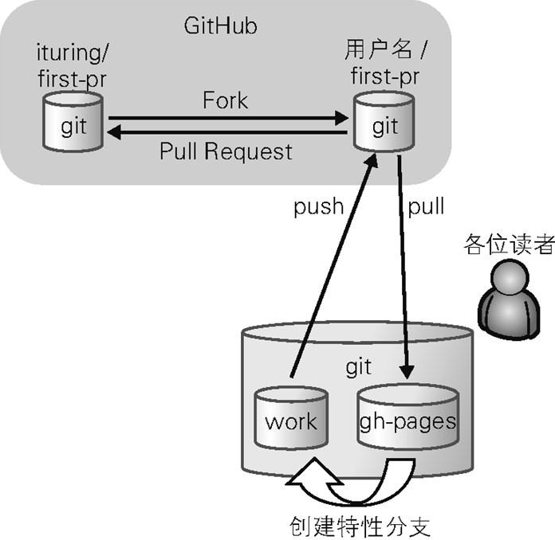
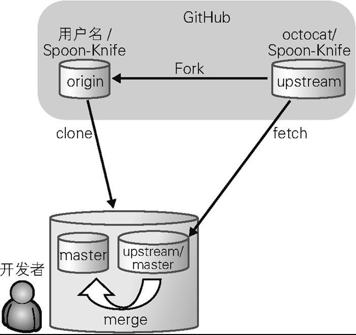

按部就班地创建 GitHub 账号并公开自己的源代码并不是什么难事。不过，刚刚接触 GitHub 的人往往不会或不敢使用 Pull Request 功能。

Pull Request 是社会化编程的象征。GitHub 创造的这一功能，可以说给开源开发世界带来了一场革命。不会用这个功能，就等于不会用 GitHub。

## Pull Request 的概要

### 什么是 Pull Request

首先我们来理解什么是 Pull Request。Pull Request 是自己修改源代码后，请求对方仓库采纳该修改时采取的一种行为。

### Pull Request 的流程

现在假设我们在使用 GitHub 上的一款开源软件。

在使用这款软件的过程中，我们偶然间发现了 BUG。为了继续使用软件，我们手动修复了这个 BUG。如果我们修改的这段代码能被该软件的开发仓库采纳，今后与我们同样使用这款软件的人就不会再遇到这个 BUG。为此，我们要第一时间发送 Pull Request。

在 GitHub 上发送 Pull Request 后，接收方的仓库会创建一个附带源代码的 Issue，我们在这个 Issue 中记录详细内容。这就是 Pull Request。

发送过去的 Pull Request 是否被采纳，要由接收方仓库的管理者进行判断。一般只要代码没有问题，对方都会采纳。如果有问题，我们会收到评论。

只要 Pull Request 被顺利采纳，我们就会成为这个项目的 Contributor（贡献者），我们编写的这段代码也将被全世界的人使用。这正是社会化编程和开源开发的一大乐趣。



1. fork

访问仓库页面，点击 Fork 按钮创建自己的仓库。

2. clone

把这个仓库 clone 到当前的开发环境中。目录下会生成 Git 仓库。这个仓库与我们 GitHub 账户下的仓库状态相同。现在只要在这个仓库中修改源代码进行 push，GitHub 账户中的仓库就会被修改。

3. branch

当前 Git 的主流开发模式都会使用特性分支。

养成创建特性分支后再修改代码的好习惯。在 GitHub 上发送 Pull Request 时，一般都是发送特性分支。这样一来，Pull Request 就拥有了更明确的特性（主题）。让对方了解自己修改代码的意图，有助于提高代码审查的效率。

确认分支

```shell
git branch -a
```

创建特性分支

```shell
git checkout -b dev main
```

4. 修复代码
5. 提交修改
6. 创建远程分支

```shell
git push origin dev
```

## 发送 Pull Request

WIP 是 Work In Progress 的简写，表示仍在开发过程中。等所有功能都实现之后，再消去这个前缀。

## 仓库的维护

Fork 或 clone 来的仓库，一旦放置不管就会离最新的源代码越来越远。如果不以最新的源代码为基础进行开发，劳神费力地编写代码也很可能是白费力气。

通常来说 clone 来的仓库实际上与原仓库并没有任何关系。所以我们需要将原仓库设置为远程仓库，从该仓库获取（fetch）数据与本地仓库进行合并（merge），让本地仓库的源代码保持最新状态（图 6.8）。



```shell
git clone git@github.com:studying-notes/git-tutorial.git
```

我们给原仓库设置 upstream 的名称，将其作为远程仓库。

```shell
git remote add upstream git@github.com:studying-notes/git-tutorial.git
```

从远程仓库实际获取（fetch）最新源代码，与自己仓库的分支进行合并。要让仓库维持最新状态，只需要重复这一工作即可。

```shell
git fetch upstream
```
